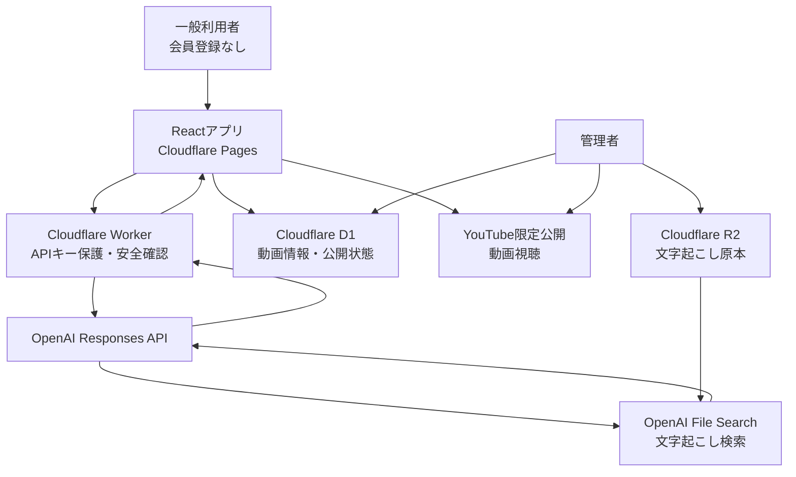
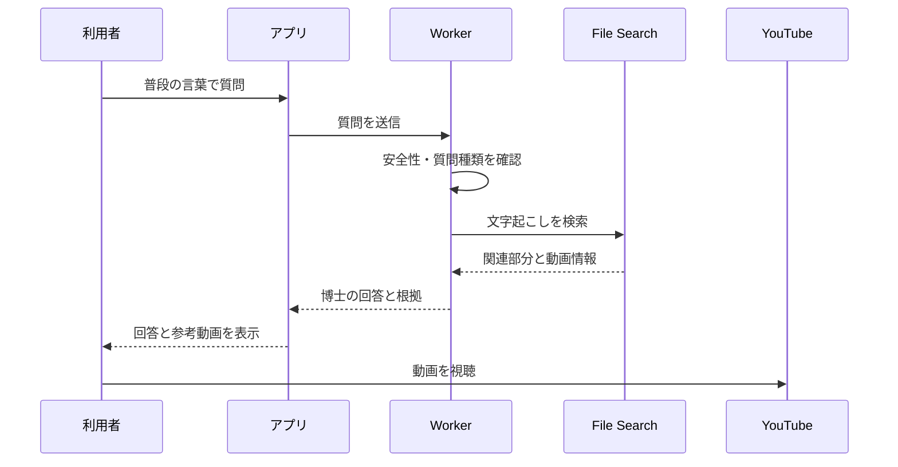

# 頭痛博士アプリ　概要・構成

## 1．アプリの目的

頭痛専門医による約10分の解説動画60本と、その文字起こしデータを活用した、一般向けの頭痛情報アプリです。

利用者が普段の言葉で質問すると、博士キャラクターが専門医の動画から関係する解説を探し、専門知識がない人にも分かりやすく説明します。

回答の根拠となった動画も表示し、その場で動画を視聴できます。

> 頭痛博士は、頭痛専門医の解説動画を案内するキャラクターです。診断や治療の判断は行いません。

## 2．想定利用者

- 頭痛について知りたい一般の人
- 医学の専門知識がない人
- 子どもから高齢者まで幅広い年代
- 自分や家族の頭痛について調べたい人

会員登録は設けず、URLを開けば誰でも利用できる一般公開型のWebアプリとします。

## 3．利用者ができること

### 3-1．博士に質問する

文字入力または音声入力で質問します。

質問例：

- 雨の前に頭が痛くなるのはなぜ？
- 片頭痛とはどんな頭痛？
- 頭痛薬はいつ飲めばいい？
- 子どもの頭痛について知りたい
- 病院へ行った方がよい頭痛は？

### 3-2．博士の回答を読む

回答は次の順番で表示します。

1. ひとことで回答
2. もう少し詳しい説明
3. 参考にした動画
4. 続けて聞ける関連質問

説明は、利用者が次のように切り替えられるようにします。

- やさしく説明
- 詳しく説明
- 読み上げる

### 3-3．解説動画を見る

カテゴリーやキーワードから動画を探して視聴できます。

カテゴリー例：

- 片頭痛
- 緊張型頭痛
- 群発頭痛
- 天気と頭痛
- 頭痛薬
- 子どもの頭痛
- 女性と頭痛
- 生活習慣
- 頭痛ダイアリー
- 受診を考える目安

## 4．主要画面

| 画面 | 内容 |
|---|---|
| ホーム | 博士キャラ、質問入力、質問例、動画への入口 |
| チャット | 質問、博士の回答、根拠動画、関連質問 |
| 動画一覧 | 検索、カテゴリー、動画カード（タイトル・説明・監修医師） |
| 動画視聴 | YouTube動画、字幕、章、文字起こし |
| 監修医師紹介 | 医師の氏名・所属・専門科の一覧 |
| 管理画面 | 動画情報・文字起こしの登録と公開管理 |

ホーム画面では、次の2つを大きく表示します。

- 博士に聞く
- 動画を見る

## 5．システム全体の構成



## 6．データの保存場所

| データ | 保存場所 | 用途 |
|---|---|---|
| 視聴用動画 | YouTube限定公開 | アプリ内で動画を再生 |
| 文字起こし正式原本 | Cloudflare R2 | 修正・復旧用の原本 |
| AI検索用文字起こし | OpenAI File Search | 質問に関係する解説を検索 |
| 動画タイトル・URL | Cloudflare D1 | 動画一覧と検索結果の表示 |
| 医師情報（氏名・所属・専門科） | Cloudflare D1 | 動画カードと監修医師紹介の表示 |
| 公開状態・File SearchファイルID | Cloudflare D1 | 公開管理とデータの対応付け |
| アプリ画面 | Cloudflare Pages | 一般公開 |
| APIキー | Cloudflare Secret | ブラウザに出さずに保管 |

## 7．文字起こしデータの形式

文字起こしは、動画1本を1ファイルとして登録します。

ファイルの先頭に動画情報を付け、本文に動画全体の文字起こしを入れます。ファイル名と動画情報には必ず動画IDを含め、検索結果から動画を特定できるようにします。

```text
動画ID：video_018
タイトル：天気と片頭痛
カテゴリー：片頭痛・天気

本文：
（動画全体の文字起こし。
「片頭痛のある方の中には、気圧の低下が
発作のきっかけになる方がいます。」など）
```

これにより、質問に対して関係する動画を特定し、根拠として案内できます。

将来、よく参照される動画から順に、話題単位（30～90秒）に分けてタイムコードを付けたデータへ差し替えることで、「該当場面から再生」へ段階的に拡張できます。

## 8．質問から回答までの流れ



### 回答例

**利用者**

> 雨の前に頭がズキズキするのはなぜ？

**頭痛博士**

> 気圧の変化が、片頭痛のきっかけになる人がいます。  
> ただし、すべての頭痛が天気によるものとは限りません。天気や睡眠、頭痛が起きた時間を記録すると、傾向を確認しやすくなります。

**参考にした動画**

> 「天気と片頭痛」  
> この動画で気圧と頭痛の関係を解説しています  
> ［動画を見る］

## 9．動画・文字起こしの登録と管理

### 9-1．登録手順

1. 管理者がYouTubeへ動画を限定公開でアップロード
2. YouTubeの動画IDを取得
3. 管理画面から動画情報と文字起こしを登録
   - 文字起こし原本をCloudflare R2へ保存
   - 検索用コピー（動画1本＝1ファイル）をOpenAI File Searchへ登録
   - タイトル・カテゴリー・YouTube動画ID・File SearchのファイルIDをD1へ登録
4. 医師または管理者が内容を確認
5. 管理画面で「公開」に切り替える

初期版で全60本を登録しますが、あとから動画を追加できる前提で設計します。

### 9-2．データ管理の原則

3か所（R2・File Search・D1）のデータがずれないよう、次の原則を守ります。

- **D1を唯一の台帳とする**：動画ID・YouTube動画ID・File SearchのファイルID・公開状態をD1に集約し、アプリは必ずD1を経由して各データへたどり着く
- **操作は必ず管理画面を通す**：R2・File Search・D1を個別に直接触らず、登録・変更・非公開化は管理画面の一連の処理として実行する
- **削除ではなく非公開フラグ**：動画を取り下げるときはD1の公開状態を「非公開」に切り替える。File Search側に古いデータが残っていても、回答生成時に公開状態でフィルタするため、非公開動画が案内されることはない
- **整合性チェック**：File Searchのファイル一覧とD1を突き合わせ、対応の取れないデータを検出する処理を管理画面から実行できるようにする

R2の正式原本は上書きせず、バージョンを追加します。

```text
transcript_2026-07-15_v1.md
transcript_2026-08-20_v2.md
```

`master/`部分にはBucket Lockを設定し、誤削除や誤上書きを防ぎます。

## 10．医療情報としての安全設計

### 10-1．診断をしない

「私は片頭痛ですか？」と聞かれても診断しません。

> このアプリでは診断できません。専門医の動画では、片頭痛の一般的な特徴として次の点が説明されています。

という形で回答します。

### 10-2．登録データにないことを推測しない

文字起こしに十分な根拠が見つからない場合は、次のように答えます。

> 登録されている専門医の解説からは、十分な情報を見つけられませんでした。

### 10-3．緊急性が疑われる場合

通常のRAG回答を止め、医師が確認した固定案内を表示します。

緊急時の文章はAIに自由生成させず、専門医が確認した内容を使用します。

### 10-4．出典を必ず表示する

回答には可能な限り次の情報を付けます。

- 動画タイトル
- 動画を見るボタン
- 情報の更新日

### 10-5．監修医師を明示する

動画カードには、解説している医師の氏名・所属（病院・大学）・専門科を表示します。また、監修医師の紹介ページを設け、どの専門医の解説に基づくアプリかを明示します。

医師情報には「所属等は動画制作時点の情報です」と添え、動画作成時点の情報であることを明示します。これにより、異動などのたびに情報を更新する必要はありません。

なお、氏名・所属をアプリに掲載することについては、公開前に各医師へ許諾を確認します（動画出演の了承とは別に確認する）。

一方、チャットの回答文には医師名を表示しません。回答はあくまで博士キャラクターによる「案内」であり、医師本人の発言と誤解されないようにするためです。

## 11．採用する技術

| 技術 | 採用理由 |
|---|---|
| React | チャット・動画・検索画面を作りやすい |
| Cloudflare Pages | Webアプリを一般公開する |
| Cloudflare Worker | APIキーを守り、質問を安全に中継する |
| OpenAI File Search | 60本の文字起こしを意味で検索する |
| OpenAI Responses API | 検索結果から博士の回答を作る |
| Cloudflare R2 | 文字起こし原本を安全に保管する |
| Cloudflare D1 | 動画情報と公開状態を管理する |
| YouTube限定公開 | 動画を安定して視聴できるようにする |

## 12．今回採用しないもの

### Cloudflare Stream

動画をYouTube限定公開で配信するため、現段階では使用しません。

### Supabase

会員管理、質問履歴、視聴履歴などを設けないため、現段階では使用しません。

将来、利用者ごとのデータ保存が必要になったときに検討します。

### 会員登録

一般の人が気軽に利用できることを優先し、初期版では設けません。

## 13．将来追加を検討する機能

- 該当場面からの再生（文字起こしを話題単位に分割し、タイムコードを付けて登録）
- お気に入り
- 質問履歴
- 視聴履歴
- 頭痛ダイアリー
- 利用者ごとのおすすめ動画
- 管理者と医師の権限分け
- 医師による回答内容の確認

これらの機能が必要になった時点で、Supabaseを含む会員・データ管理基盤の導入を検討します。

## 14．最終的なアプリの位置づけ

このアプリは、AIが頭痛を診断するサービスではありません。

> 頭痛専門医が60本の動画で説明している知識を、一般の人が質問を通して探し、理解し、必要な動画をすぐ視聴できるようにするアプリ

です。

博士キャラクターは医師の代わりではなく、「専門医の解説と利用者をつなぐ、やさしい案内役」として設計します。
